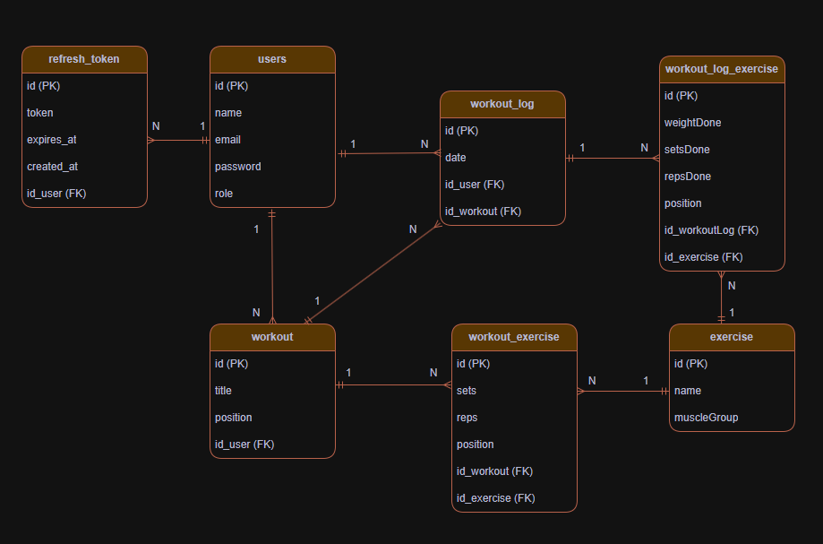

# Workout Tracker API

API REST para gerenciamento de treinos de academia, permitindo criar rotinas,
registrar exercícios e treinos executados e acompanhar progresso ao longo do tempo.

## Tecnologias

- Java 21
- Spring Boot 4.1.0
- Spring Data JPA / Hibernate
- PostgreSQL
- Flyway (migrations)
- Spring Security + JWT
- Docker / Docker Compose
- JUnit 5 + Mockito (testes unitários)
- H2 Database (testes de integração)

## Funcionalidades

- Autenticação com JWT (registro, login, refresh token, logout)
- Gerenciamento de treinos (criar, editar, excluir, reordenar)
- Gerenciamento de exercícios (CRUD + importação via API externa)
- Associação de exercícios a treinos (séries, repetições, posição para ordenação)
- Registro de treinos executados (logs), com filtro por data e período
- Registro de desempenho por exercício em cada treino executado (qntd repetições, séries e peso)

## Pré-requisitos

- Docker e Docker Compose instalados

**Alternativa sem Docker:**
- Java 21
- Maven
- PostgreSQL instalado e rodando localmente
  
## Como rodar o projeto

### 1. Clone o repositório

```bash
git clone https://github.com/mixsz/workout-tracker.git
cd workout-tracker
```

### 2. Configure as variáveis de ambiente

Crie um arquivo `.env.docker` na raiz do projeto com as seguintes chaves:

```
DB_URL=jdbc:postgresql://db:5432/workout-tracker
DB_USERNAME=postgres
DB_PASSWORD=sua_senha
DB_NAME=workout-tracker
DB_TOKEN_SECRET=sua_chave_secreta_jwt
NINJA_API_KEY=sua_chave_da_api_ninjas
```

### 3. Suba os containers

```bash
docker-compose up --build
```

### 4. Acesse a API

A aplicação estará disponível em `http://localhost:8080`

## Autenticação

O fluxo de autenticação segue o padrão JWT:

1. Registre um usuário em `POST /auth/register`
2. Faça login em `POST /auth/login` e receba um `token` e `refreshToken`
3. Envie o token nas requisições protegidas via header:

   ```
   Authorization: Bearer <token>
   ```

## Endpoints principais

### Auth (`/auth`)

| Método | Rota | Descrição |
|---|---|---|
| POST | /auth/register | Cria um novo usuário |
| POST | /auth/login | Autentica e retorna tokens |
| POST | /auth/refresh | Gera novo token a partir do refresh token |
| POST | /auth/logout | Invalida o refresh token |
| GET | /auth/me | Retorna dados do usuário logado |

### Workout (`/workout`)

| Método | Rota | Descrição |
|---|---|---|
| GET | /workout | Lista treinos do usuário |
| POST | /workout | Cria um treino |
| PUT | /workout/{id} | Atualiza um treino |
| PUT | /workout/reorder | Reordena os treinos |
| DELETE | /workout/{id} | Remove um treino |

### Exercise (`/exercise`)

| Método | Rota | Descrição |
|---|---|---|
| GET | /exercise | Lista exercícios (filtro por nome e/ou grupo muscular) |
| GET | /exercise/{id} | Busca um exercício por ID |
| POST | /exercise | Cria um exercício |
| PUT | /exercise/{id} | Atualiza um exercício |
| DELETE | /exercise/{id} | Remove um exercício |
| POST | /exercise/import | Importa exercícios de uma API externa por grupo muscular |

### WorkoutExercise (`/workoutExercise`)

| Método | Rota | Descrição |
|---|---|---|
| GET | /workoutExercise/{workoutId} | Lista exercícios de um treino |
| GET | /workoutExercise/{workoutId}/{exerciseId} | Busca um exercício específico do treino |
| POST | /workoutExercise/{workoutId} | Adiciona um exercício ao treino |
| PATCH | /workoutExercise/{workoutId}/{exerciseId} | Atualiza séries/repetições de um exercício do treino |
| PUT | /workoutExercise/{workoutId}/reorder | Reordena os exercícios do treino |
| DELETE | /workoutExercise/{workoutId}/{exerciseId} | Remove um exercício do treino |

### WorkoutLog (`/workoutLog`)

| Método | Rota | Descrição |
|---|---|---|
| GET | /workoutLog | Lista todos os registros de treino do usuário |
| GET | /workoutLog/{workoutId} | Lista registros de um treino específico |
| GET | /workoutLog/date | Lista registros em uma data específica |
| GET | /workoutLog/date/between | Lista registros entre duas datas |
| GET | /workoutLog/date/between/{workoutId} | Lista registros de um treino entre duas datas |
| POST | /workoutLog/{workoutId} | Cria um novo registro de treino executado |
| DELETE | /workoutLog/{workoutLogId} | Remove um registro de treino |

### WorkoutLogExercise (`/workoutLogExercise`)

| Método | Rota | Descrição |
|---|---|---|
| GET | /workoutLogExercise/{workoutLogId} | Lista exercícios executados em um registro de treino |
| GET | /workoutLogExercise/{workoutLogId}/{exerciseId} | Busca um exercício executado específico |
| POST | /workoutLogExercise/{workoutLogId} | Registra um exercício executado (peso, séries, repetições) |
| PATCH | /workoutLogExercise/{workoutLogId}/{exerciseId} | Atualiza um exercício executado |
| DELETE | /workoutLogExercise/{workoutLogId}/{exerciseId} | Remove um exercício executado do registro |

## Testes

O projeto possui testes unitários (regras de negócio dos services) e de
integração (fluxos completos via `@SpringBootTest`, com banco H2 em memória).

Para rodar todos os testes:

```bash
mvn test
```

## Estrutura do projeto

```
src/main/java/com/mixsz/workouttracker/
├── controller/       # Endpoints REST
├── service/          # Regras de negócio
├── repository/       # Acesso a dados (Spring Data JPA)
├── model/            # Entidades JPA
├── dto/              # Objetos de request/response
├── exception/        # Exceções customizadas e handler global
├── infra/security/   # Configuração de segurança e JWT
└── enums/            # Enums do domínio (MuscleGroup e UserRole)
```

## Modelo de Dados



## Status do projeto

Projeto desenvolvido para estudo prático de Spring Boot, cobrindo desde a
fundação (API REST, JPA) até segurança (Spring Security + JWT) e qualidade
(testes unitários, testes de integração, Docker).
